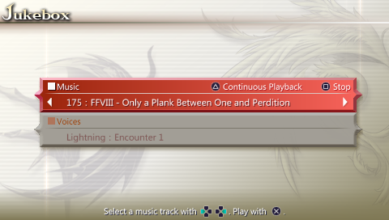

## Duodecim BGM Cheat Generator

This project is a freeware fanmade **CWCheat** generator developed for changing the soundtrack display titles of the [Dissida Duodecim](https://store.na.square-enix.com/product/283075/dissidia-012-duodecim-final-fantasy-psp) game.

This will change only the text cached to the internal memory of the PSP, so the original game is not altered at all and all its content remain **untouched**.

It was a great oportunity to learn more on Java programming, and it would make me really happy if my work helps people out there. =)

**Built with Java 7.**
The latest version of JRE/JDK can be found [here](http://www.oracle.com/technetwork/java/javase/downloads/index.html).

**Requires CWCheat.**
All information about the installation and usage of the CWCheat plugin can be found [here](http://gamehacking.org/wiki/CWCheat).

## Changelog

**version 1.2** (December 12, 2011)
- Added French and Italian translations
- Interface revised

**version 1.1** (September 24, 2011)
- Bugfixes on CWCheat code generation
- Implementation of file and media support
- Implemented gradient and translucency effects
- Initial release

**version 1.0** (August 15, 2011)
- Assembled offset database from the PSP memory
- Created main command line engine
- Created a primitive interface
- Internal version

## Credits

This project was created and programmed by me (https://github.com/convalise).

The Final Fantasy logos were reproduced by [Eldi](http://eldi13.deviantart.com).
You can check her **amazing** work on her [DeviantArt](http://eldi13.deviantart.com) page.

Translations done by  [Oniangel](http://dissidiaforums.com/member.php?614-Oniangel) and  [DeanW](http://dissidiaforums.com/member.php?6543-DeanW) from the [DissidiaForums](http://dissidiaforums.com/).

This small app is a freeware fanmade cheat generator for **CWCheat** and is not licensed by Square Enix.  
FINAL FANTASY is a registered trademark of Square Enix Holdings Co., Ltd.

## License

**This software is licensed under GNU GPL version 3.** You can find the full text of the license [here](LICENSE).
